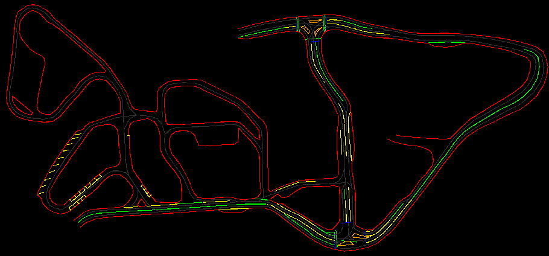

<div align="center">
<h1>Tinycarlo</h1>
Think of <a href="https://carla.org//">Carla</a> but much lighter and simpler or  the <a href="https://www.gymlibrary.dev/environments/box2d/car_racing/"> Car Racing gym </a> but more serious.
<br><br>

</div>

Assuming you already have a working perception system, you can use this [gym environment](https://gymnasium.farama.org/index.html) to train path planning, control and decision-making algorithms.
Examples use detected lane lines, such as road edges, dashed, solid and waiting lines. 

It lets you customize the car, to fit your real-world counterpart, and design custom tracks with our [Mapbuilder](./mapbuilder/README.md).
The observation space is a customizable camera image and the action space includes steering, throttle and a discrete maneuver (straight, left, right, u-turn). 

Feel free to make any suggestions for additional features or changes.

## Features
### Camera simulation
The laneline points from the map are projected onto the camera image, simulating the perception system.
[Knuffingen](https://youtu.be/025U4egWtLs?si=5optWMQxrPYBHx00&t=93) | Formula Student 
:---:|:---:
 | 

You can also modify the camera parameters to simulate your real-world setup.
```yaml
camera:
  position: [0,0,0.03]  # [x,y,z] in meters relative to middle of front axle
  orientation: [20,0,0] # [pitch,roll,yaw] in degrees)
  resolution: [480,640] # [height, width] in px
  fov: 90               # in degrees
  max_range: 0.5        # render distance in meters (can be None for infinite range)
  line_thickness: 2     # rendered line thickness in px
```

### Lanepath Tracking
Some scenarios want complete freedom for the car. Others might need more info about current state, such as cross-track error, heading error, etc. For this, the lanepath is used. Depending on the given maneuver the car will track the lanepath differently. The lanepath is set with the [Mapbuilder](./mapbuilder/README.md) in the same way as the lanelines, only that direction matters.

The [stanley controller example](./examples/stanley_control.py) shows how this info can be leveraged. 
### Reward shaping
Using wrappers, you can modify the reward function to fit your needs.
```python
import gymnasium as gym
import tinycarlo
from tinycarlo.wrappers import CTESparseRewardWrapper

env = gym.make("tinycarlo-v2", config=config, render_mode="human")
env = CTESparseRewardWrapper(env, 0.01)
```
You can also stack multiple wrappers.

## Limitations
### Physics
To keep it simple and lightweight no physics engine is used (yet). Only the kinematics, not the dynamics, are simulated. This means that the car can't overstear or understeer. It also has no slip. You can literray go as fast as you want around a corner. This will be changed in the future.

### Perception
Only camera is simulated. Other sensors like lidar, radar, ultrasonic, etc. are not simulated (yet). There is also no support for 3D object detection even though it is not much code needed to add this feature. The camera already does a proper projection of 3D points onto the 2D image with clipping and Z-Buffering. For the lanelines, z is simply set to 0.

## Installation
The current recommended way to install tinycarlo is from source.
### From source
```bash
git clone https://github.com/danielriege/tinycarlo
cd tinycarlo
python3 -m pip3 install -e .
```

## Usage
In order to properly create the environment, you need to provide a configuration file. Look at the [example](./examples/config_simple_layout.yaml) for a detailed explanation of the parameters.

The observation space is defined by the camera resolution and the `observation_space_format` in `sim` config. For the `"rgb"` format the observation space is `HxWx3` and for the `"classes"` format it is `CxHxW` with each channel being a binary mask. 

The action space is dictionary with `"car_control"` and `"maneuver"`. car_control is a tuple of steering and throttle, both in [-1, 1] range. maneuver is a discrete action space with 4 actions: straight, right, u-turn, left. Depending on the maneuver, the car tracking of lanepath is adjusted. For a u-turn a not connected path segment is selected, based on the new direction of travel.

info is a dictionary with additional information about the car state, such as the current position, cross-track and heading error and distances to nearest laneline segments. All except the position are dependent on the lanepath set with the mapbuilder.

### Quick example with yaml
```python
import gymnasium as gym
import tinycarlo

config_path = "path/to/your/config.yaml"
env = gym.make("tinycarlo-v2", config=config_path, render_mode="human")

observation, info = env.reset()

while True:
    action = env.action_space.sample()
    observation, reward, terminated, truncated, info = env.step(action)
    if terminated or truncated:
        observation, info = env.reset()
        break

env.close()
```

### Quick example with dict
```python
import gymnasium as gym
import tinycarlo

config = {
    "sim": {
        "fps": 30,
    },
    "camera": {
        "position": [0, 0, 0.03],  # [x,y,z] in m relative to middle of front axle
        "orientation": [20, 0, 0], # [pitch,roll,yaw] in degrees
        "resolution": [480, 640],  # [height, width] in pixels
    },
    ...
}
env = gym.make("tinycarlo-v2", config=config, render_mode="human")
...
```
## Running tests
The test coverage is not yet complete. 

```bash
python3 -m pip install -e .[testing] # install extra deps for testing
python3 test/test_layer.py           # just the layer tests
python3 -m pytest                    # whole test suite
```