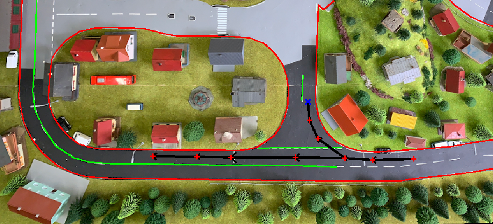

# Mapbuilder
The mapbuilder is a tool to create custom tracks for the [tinycarlo](../README.md) environment. It is a simple OpenCV based GUI to draw lanelines and lanepaths. The lanelines are used to simulate the perception system and the lanepath is used to simulate the car tracking the lane.

## Usage
After installing tinycarlo, you can start the mapbuilder with the following command:
```bash
tinycarlo.mapbuilder /path/to/an/image.png 
```
Inside the tinycarlo repo, you can use `examples/maps/simple_layout.png` as an testing image. If no argument is provided, a new image with the default size of 512x512 is created.

### Layers
The mapbuilder supports multiple layers, which can be used to create different lanelines and lanepaths. The layers are saved in the order they are created. Each layer represents a class of laneline or a lanepath. 

When a new layer is created, you will be asked if it's going to be a laneline or a lanepath. In case of a laneline, you will be asked for the name and color of the laneline/layer. For a lanepath, this is skiped. 

### Controls:
- `q` to quit and save the map
- `n` to create a new layer
- `u` to undo the last action in the current layer
- `r` to reset the current layer
- `left click` to add a new node
- `right click` to select a node
- `right click and drag` selected node is moved
- `mouse wheel` to zoom and navigate the map (Only for OpenCV with QT backend)

After each layer, the current progress will be saved. The maps are in `.json` format. 
